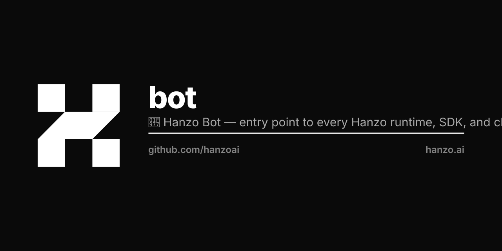

<p align="center"></p>

# Hanzo Bot

Hanzo Bot is a personal AI assistant you run on your own machine. It sits behind a local
gateway process and answers you on the chat apps you already use — WhatsApp, Telegram,
Slack, Discord, Signal, iMessage, Matrix, IRC, Teams and about a dozen more — so the
assistant is reachable from your phone without anything of yours leaving your machine.

<p align="center">
  <a href="https://github.com/hanzoai/bot/actions/workflows/ci.yml?branch=main"></a>
  <a href="https://github.com/hanzoai/bot/releases"></a>
  <a href="LICENSE"></a>
</p>

## Install

Node 22 or newer:

```bash
npm install -g @hanzo/bot
```

That gives you two names for the same program, `bot` and `hanzo-bot`. Then run the
onboarding wizard, which walks through the gateway, the workspace, your channels and
skills, and installs the gateway as a launchd/systemd user service so it stays up:

```bash
hanzo-bot onboard --install-daemon
```

## First things to try

```bash
hanzo-bot status                       # channel health, recent sessions
hanzo-bot agent -m "ship checklist"    # one agent turn
hanzo-bot message send --target +15555550123 --message "Hi"
hanzo-bot dashboard                    # open the control UI
hanzo-bot doctor                       # health checks and quick fixes
```

`hanzo-bot --help` lists every command; each one takes `--help` of its own. To run the
gateway in the foreground instead of as a service, `hanzo-bot gateway run --port 18789`.

A note on models: the assistant reads your messages and acts on them, so prompt injection
is a real risk. Use the strongest current model you have access to. `hanzo-bot models`
manages selection and auth.

## From source

```bash
git clone https://github.com/hanzoai/bot.git
cd bot
pnpm install
pnpm ui:build
pnpm build
pnpm hanzo-bot onboard --install-daemon
```

`pnpm gateway:watch` is the dev loop. There are also Compose files (`compose.yml`) and
Dockerfiles in the repository if you would rather run it in a container.

## Docs

The documentation lives in [`docs/`](docs/) in this repository — it is not published to a
website yet, so read it here or with `hanzo-bot docs`.

- [Getting started](docs/start/getting-started.md) · [Onboarding](docs/start/onboarding.md) · [Quickstart](docs/start/quickstart.md)
- [Channels](docs/channels/) — one page per chat app, including how to connect it
- [Concepts](docs/concepts/) — the agent loop, sessions, memory, [models](docs/concepts/models.md), [model failover](docs/concepts/model-failover.md)
- [CLI reference](docs/cli/) · [Gateway](docs/gateway/) · [Installing and updating](docs/install/)
- [FAQ](docs/help/faq.md)
- [`SECURITY.md`](SECURITY.md) — the trust model, and why DM access is closed by default
- [`LLM.md`](LLM.md) — the deep reference for anyone working on the code

## Release channels

Stable releases are tagged `vYYYY.M.D` and published to npm as `latest`. Prereleases go to
`beta`, and the moving head of `main` to `dev` when published. Switch with
`hanzo-bot update --channel stable|beta|dev`.

## License

MIT — see [LICENSE](LICENSE).
